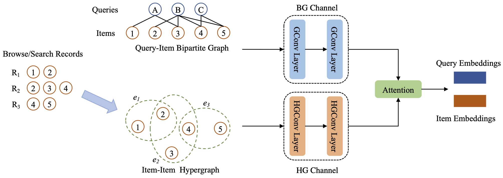

# Search Behavior Prediction: A Hypergraph Perspective

Yan Han, Eddie Huang, Wenqing Zheng, Nikhil Rao, Zhangyang Wang, Karthik Subbian.

# Dual-Channel Attention-based Hypergraph Neural Network (DCAH)



This framework utilizes the free-available auxiliary information to create a hypergraph to assist the main task of link prediction.

## Environment Setup

We recommend you to create a conda environment:

```
conda create -n <myenv> python=3.7
conda activate <myenv>
conda install pytorch torchvision torchaudio cudatoolkit=11.3 -c pytorch
conda install pyg -c pyg
pip install ogb==1.3.3
```

If any above command fails, we also attached an enviroment.yml file to create the environment:

```
conda env create -f environment.yml
conda activate <myenv>
```

The first line of the yml file sets the new environment's name, it can be changed manually to any name you want.


## Dataset Preprocessing

Since the e-commerce dataset used in this paper is proprietary, we only share the public dataset preprocessing. Please modify the save path when running the following script. Here we provide two examples. The first one is ogb-citation dataset, the node represents the paper and the link represents the citation relationship between two papers. The auxiliary information here is the topics of the papers, which can be represented as a hypergraph by clustering the papers of the same topic, the prior here is that the papers of the same topic are more likely to cite each other. The second one is ogb-collaboration dataset, the node represents the author and the link represents the co-authorship relationship between two authors. The auxiliary information here is the instituations of the authors, which can be represented as a hypergraph by clustering the authors of the same instituation, the prior here is that the authors of the same instituation are more likely to colloaborate.

```
python preprocess_ogb.py --save_path <your own path> --sampled_authors <50000>
```

The above command will generate four graphs (two normal graphs + two hypergraphs), both in the format of edge_index array. Note that for ogb-collaboration graph, since the original graph is huge, which is hard to be loaded in a single GPU, it needs to be sampled.

## Pre-Train

Pre-train a DCAH via contrastive learning

```
python pretrain.py --data_name <citation or collaboration> --epochs 200 --encoder dual
```

**Note**: Remember to create a folder to save the model checkpoints, and replace the save path of the script.


## Finetune or Train from Scratch

Finetune a pre-trained DCAH on a downstream task

```
python trainer_link_prediction.py --data_name <citation or collaboration> --encoder dual --load <checkpoints path> --eval_metric <mrr or recall_my@1>
```

Train a DCAH from scratch

```
python trainer_link_prediction.py --data_name <citation or collaboration> --encoder dual --eval_metric <mrr or recall_my@1>
```

## Train from Scratch using DropEdge

```
python trainer_link_prediction.py --data_name <citation or collaboration> --encoder dual --eval_metric <mrr or recall_my@1> --use_drop_edge True
```
